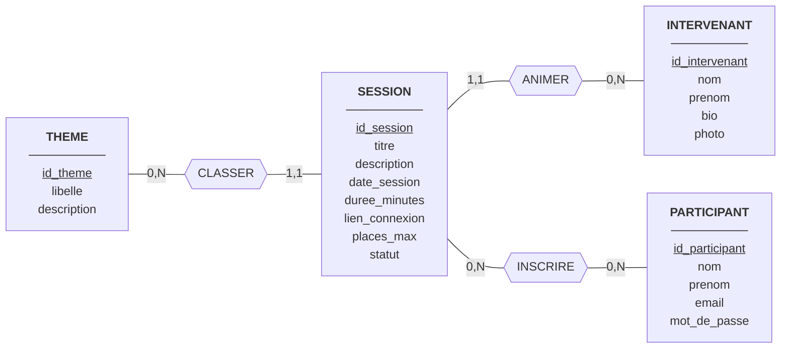

# MCD — Plateforme de Webinaires

## Entités

| Entité | Identifiant | Propriétés |
|--------|-------------|-----------|
| THEME | id_theme | libelle, description |
| INTERVENANT | id_intervenant | nom, prenom, bio, photo |
| PARTICIPANT | id_participant | nom, prenom, email, mot_de_passe |
| SESSION | id_session | titre, description, date_session, duree_minutes, lien_connexion, places_max, statut |

## Associations

| Association | Entités liées | Signification |
|-------------|---------------|---------------|
| CLASSER | THEME, SESSION | Un thème classe des sessions |
| ANIMER | INTERVENANT, SESSION | Un intervenant anime des sessions |
| INSCRIRE | PARTICIPANT, SESSION | Un participant s'inscrit à des sessions |

## Cardinalités

| Association | Entité | Cardinalité |
|-------------|--------|-------------|
| CLASSER | THEME | 0,N |
| CLASSER | SESSION | 1,1 |
| ANIMER | INTERVENANT | 0,N |
| ANIMER | SESSION | 1,1 |
| INSCRIRE | PARTICIPANT | 0,N |
| INSCRIRE | SESSION | 0,N |

## Schéma

*Figure 1 : MCD de la plateforme de webinaires (identifiants soulignés).*