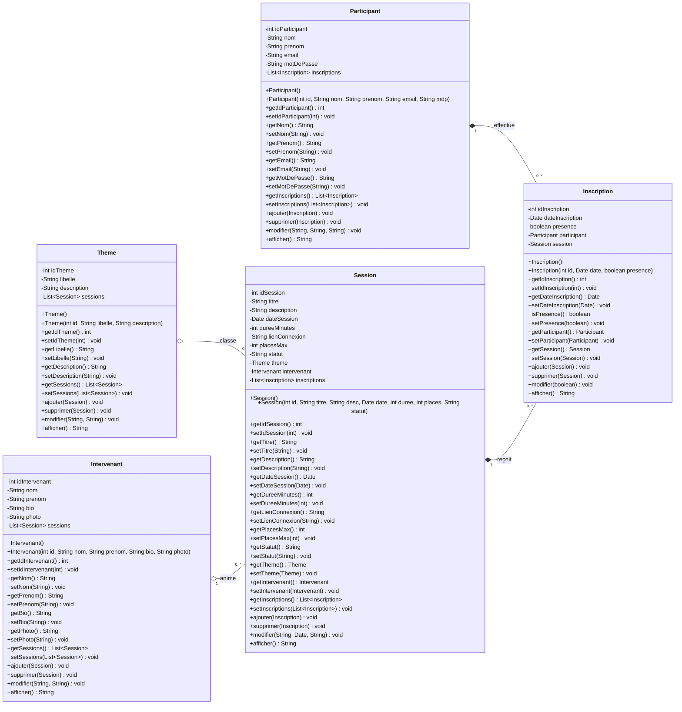

# Diagramme de classes — Plateforme de Webinaires

```mermaid
classDiagram
    direction LR

    class Theme {
        -int idTheme
        -String libelle
        -String description
        -List~Session~ sessions
        +Theme()
        +Theme(int id, String libelle, String description)
        +getIdTheme() int
        +setIdTheme(int) void
        +getLibelle() String
        +setLibelle(String) void
        +getDescription() String
        +setDescription(String) void
        +getSessions() List~Session~
        +setSessions(List~Session~) void
        +ajouter(Session) void
        +supprimer(Session) void
        +modifier(String, String) void
        +afficher() String
    }

    class Intervenant {
        -int idIntervenant
        -String nom
        -String prenom
        -String bio
        -String photo
        -List~Session~ sessions
        +Intervenant()
        +Intervenant(int id, String nom, String prenom, String bio, String photo)
        +getIdIntervenant() int
        +setIdIntervenant(int) void
        +getNom() String
        +setNom(String) void
        +getPrenom() String
        +setPrenom(String) void
        +getBio() String
        +setBio(String) void
        +getPhoto() String
        +setPhoto(String) void
        +getSessions() List~Session~
        +setSessions(List~Session~) void
        +ajouter(Session) void
        +supprimer(Session) void
        +modifier(String, String) void
        +afficher() String
    }

    class Participant {
        -int idParticipant
        -String nom
        -String prenom
        -String email
        -String motDePasse
        -List~Inscription~ inscriptions
        +Participant()
        +Participant(int id, String nom, String prenom, String email, String mdp)
        +getIdParticipant() int
        +setIdParticipant(int) void
        +getNom() String
        +setNom(String) void
        +getPrenom() String
        +setPrenom(String) void
        +getEmail() String
        +setEmail(String) void
        +getMotDePasse() String
        +setMotDePasse(String) void
        +getInscriptions() List~Inscription~
        +setInscriptions(List~Inscription~) void
        +ajouter(Inscription) void
        +supprimer(Inscription) void
        +modifier(String, String, String) void
        +afficher() String
    }

    class Session {
        -int idSession
        -String titre
        -String description
        -Date dateSession
        -int dureeMinutes
        -String lienConnexion
        -int placesMax
        -String statut
        -Theme theme
        -Intervenant intervenant
        -List~Inscription~ inscriptions
        +Session()
        +Session(int id, String titre, String desc, Date date, int duree, int places, String statut)
        +getIdSession() int
        +setIdSession(int) void
        +getTitre() String
        +setTitre(String) void
        +getDescription() String
        +setDescription(String) void
        +getDateSession() Date
        +setDateSession(Date) void
        +getDureeMinutes() int
        +setDureeMinutes(int) void
        +getLienConnexion() String
        +setLienConnexion(String) void
        +getPlacesMax() int
        +setPlacesMax(int) void
        +getStatut() String
        +setStatut(String) void
        +getTheme() Theme
        +setTheme(Theme) void
        +getIntervenant() Intervenant
        +setIntervenant(Intervenant) void
        +getInscriptions() List~Inscription~
        +setInscriptions(List~Inscription~) void
        +ajouter(Inscription) void
        +supprimer(Inscription) void
        +modifier(String, Date, String) void
        +afficher() String
    }

    class Inscription {
        -int idInscription
        -Date dateInscription
        -boolean presence
        -Participant participant
        -Session session
        +Inscription()
        +Inscription(int id, Date date, boolean presence)
        +getIdInscription() int
        +setIdInscription(int) void
        +getDateInscription() Date
        +setDateInscription(Date) void
        +isPresence() boolean
        +setPresence(boolean) void
        +getParticipant() Participant
        +setParticipant(Participant) void
        +getSession() Session
        +setSession(Session) void
        +ajouter(Session) void
        +supprimer(Session) void
        +modifier(boolean) void
        +afficher() String
    }

    Theme "1" o-- "0..*" Session : classe
    Intervenant "1" o-- "0..*" Session : anime
    Participant "1" *-- "0..*" Inscription : effectue
    Session "1" *-- "0..*" Inscription : reçoit
```