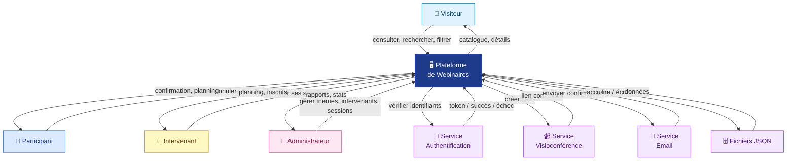

# Diagramme de contexte — Plateforme de Webinaires

```mermaid
graph TB
    V["👤 Visiteur"]
    P["🎫 Participant"]
    I["🎤 Intervenant"]
    A["👑 Administrateur"]
    SYS["🖥️ Plateforme<br/>de Webinaires"]
    AUTH["🔐 Service<br/>Authentification"]
    VISIO["📹 Service<br/>Visioconférence"]
    MAIL["📧 Service<br/>Email"]
    DB["🗄️ Fichiers JSON"]

    V -->|"consulter, rechercher, filtrer"| SYS
    SYS -->|"catalogue, détails"| V

    P -->|"réserver, annuler, planning"| SYS
    SYS -->|"confirmation, planning"| P

    I -->|"consulter ses sessions"| SYS
    SYS -->|"planning, inscrits"| I

    A -->|"gérer thèmes, intervenants, sessions"| SYS
    SYS -->|"rapports, stats"| A

    SYS -->|"vérifier identifiants"| AUTH
    AUTH -->|"token / succès / échec"| SYS

    SYS -->|"créer salle"| VISIO
    VISIO -->|"lien connexion"| SYS

    SYS -->|"envoyer confirmation"| MAIL
    MAIL -->|"accusé"| SYS

    SYS -->|"lire / écrire"| DB
    DB -->|"données"| SYS

    style SYS fill:#1e3a8a,stroke:#1e40af,stroke-width:3px,color:#ffffff
    style V fill:#e0f2fe,stroke:#0284c7,color:#0c4a6e
    style P fill:#dbeafe,stroke:#2563eb,color:#1e3a8a
    style I fill:#fef9c3,stroke:#ca8a04,color:#713f12
    style A fill:#fce7f3,stroke:#db2777,color:#831843
    style AUTH fill:#f3e8ff,stroke:#9333ea,color:#581c87
    style VISIO fill:#f3e8ff,stroke:#9333ea,color:#581c87
    style MAIL fill:#f3e8ff,stroke:#9333ea,color:#581c87
    style DB fill:#f3e8ff,stroke:#9333ea,color:#581c87
```